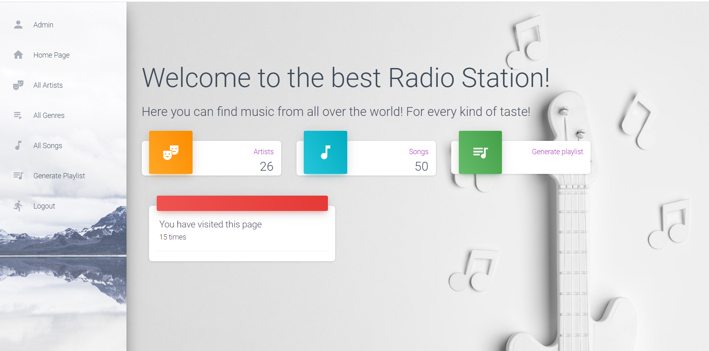

# Radio Station

Radio Station is a web application that allows users to explore and manage a collection of songs sorted by genres and artists. Authenticated users have the ability to add, update, and delete data within the website.
also it can create a playlist of songs of particular genre and number of songs

## DB Structure 


## Check it out!
   [Radio station project deployed on Render](https://radio-station-2ct2.onrender.com/)
# Log in using:
    
      admin: admin
      password: 1234

or create your own user using python manage.py createsuperuser
## Installation

1. Clone the repository:

   ```shell
   git clone https://github.com/KirillMelanich/radio_station.git
   
2. Navigate to the project directory and activate virtual environment:
   ```shell
   cd radio-station
   python3 - venv venv
   venv/Scripts/activate(on Windows)
   source venv/bin/activate(on Mac)
   
3. Install dependencies:
   ```shell
    pip install -r requirements.txt
   
4. Perform database migrations:
    ```shell
    python manage.py migrate

5. Add these apps to `INSTALLED_APPS` and install them corresponding to the `CRISPY_TEMPLATE_PACK` bootstrap version.

      ```python
        INSTALLED APPS = [
      ...,
      "crispy_bootstrap4",
      "crispy_forms",
   ]
   ```

## Usage

1. Run the development server:
     ```shell
    python manage.py runserver
2. Open your web browser and visit:
    ```shell 
    http://localhost:8000/

3. Start exploring and managing the songs, genres, and artists within the Radio Station!

# Folder structure:
         
                radio_station
        ├── catalog
        │   ├── migrations
        │   ├── static
        │   ├── templates
        │   ├── admin.py
        │   ├── models.py
        │   ├── views.py
        │   ├── tests.py
        │   └── ...
    ├── radio_station
    │   ├── settings.py
    │   ├── urls.py
    │   ├── wsgi.py
    │   └── ...
    ├── templates
    │   ├── catalog
    │   ├── includes
    │   ├── registration
    │   ├── base.html
    │   └── ... 
    ├── static
    │   ├── asserts
    │   ├── css
    │   └── ...
    ├── manage.py
    └── README.mdradio-station
    ├── requirements.py
    └── .gitignore
    └── db.sqlite3
    └── .env


## Features:
```shell 
User authentication: Allow users to sign up, log in, and manage their account.
Songs: Browse, add, update, and delete songs in the collection.
Genres: View and manage genres of songs.
Artists: Explore and manage artists associated with songs.
Playlists: You can generate a playlist of particular genre and number of songs
```

## Demo 
